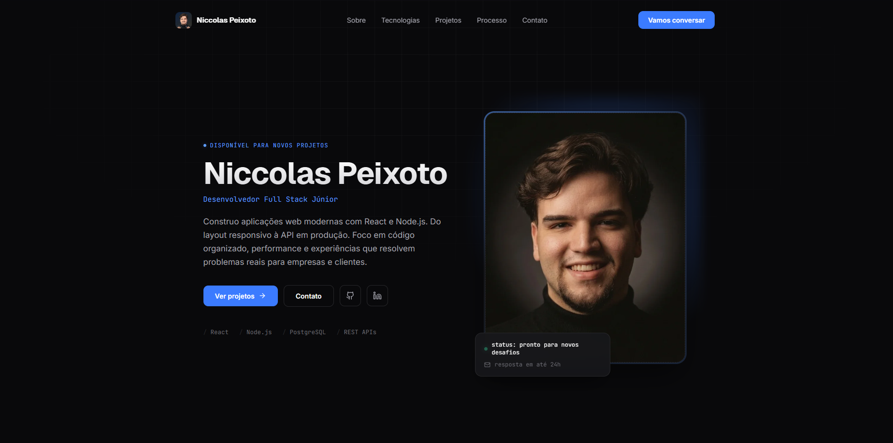

# 💻 Portfólio - Niccolas Peixoto



## 🚀 Sobre o projeto

Este é o meu portfólio profissional como Desenvolvedor Full Stack Júnior, criado para apresentar minha trajetória, tecnologias, projetos desenvolvidos e experiências na área de desenvolvimento web.

O objetivo do projeto é construir uma presença digital profissional, demonstrando minhas habilidades na criação de interfaces modernas, responsivas e com boa experiência de usuário.

O portfólio apresenta projetos reais, minha evolução como desenvolvedor e as principais tecnologias que utilizo no desenvolvimento de aplicações web.


## 🌐 Deploy

🔗 Acesse o projeto:
https://niccolaspeixoto.com/


## ✨ Funcionalidades

- ✅ Interface moderna com tema dark
- ✅ Design responsivo para desktop, tablet e mobile
- ✅ Animações durante a navegação utilizando scroll reveal
- ✅ Timeline interativa mostrando evolução profissional
- ✅ Apresentação de tecnologias utilizadas
- ✅ Cards de projetos com informações técnicas
- ✅ Links para projetos externos
- ✅ Seção de contato
- ✅ SEO básico configurado
- ✅ Estrutura otimizada para performance


# 🛠️ Tecnologias utilizadas

## Front-end

- React
- JavaScript ES6+
- Vite
- CSS3
- HTML5
- Lucide React


## Estilização e UI

- CSS Modules / CSS puro
- Flexbox
- CSS Grid
- Animações CSS
- Design responsivo


## Ferramentas

- Git
- GitHub
- Vercel
- Hostinger
- VS Code


# 📂 Estrutura do projeto


src
├── assets
├── components
├── sections
├── styles
├── App.jsx
└── main.jsx

public
└── projects
├── arena-pro-beach.png
└── football-store.png


# 📌 Projetos apresentados

## 🏖️ Arena Pro Beach

Landing page desenvolvida para um complexo esportivo.

O projeto teve como objetivo apresentar os serviços da empresa, melhorar a experiência dos visitantes e facilitar a conversão de novos clientes.

Tecnologias:

- HTML
- CSS
- JavaScript


## ⚽ Football Store CRUD

Aplicação Full Stack para gerenciamento de produtos esportivos.

O projeto envolve comunicação entre frontend e backend, operações CRUD e integração com banco de dados.

Tecnologias:

- React
- Node.js
- Prisma
- PostgreSQL


# ⚙️ Como executar o projeto localmente

### Clone o repositório

```bash
git clone https://github.com/seuusuario/seu-repositorio.git


📚 Aprendizados

Durante o desenvolvimento deste projeto, pratiquei e evoluí principalmente em:

Criação de layouts modernos e responsivos
Organização de componentes React
Manipulação de assets e estrutura de projetos Vite
Animações e experiência de usuário
Boas práticas de CSS
Performance e otimização de aplicações web
Deploy de aplicações frontend


🔮 Melhorias futuras
Adicionar novos projetos ao portfólio
Criar versão em inglês
Implementar mais otimizações de SEO
Adicionar testes automatizados
Melhorar acessibilidade


👨‍💻 Autor
Niccolas Peixoto

Desenvolvedor Full Stack Júnior apaixonado por tecnologia e criação de soluções digitais.

Contatos:

LinkedIn:
https://linkedin.com/in/niccolas-peixoto/

GitHub:
https://github.com/seuusuario

Portfolio:
https://niccolaspeixoto.com/